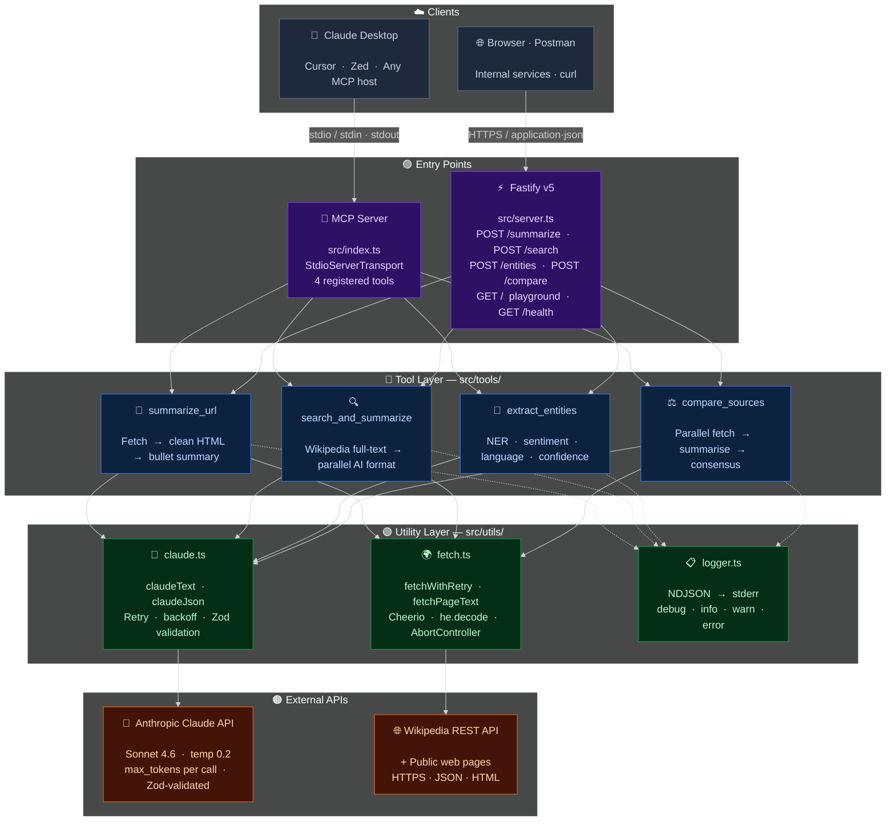

<div align="center">

<br/>

<h1>🔬</h1>

# research-mcp

### AI-powered research tools for Claude Desktop & REST clients

<br/>

[](https://github.com/pritmon/research-mcp/actions/workflows/ci.yml)
[](https://research-mcp-dbwy.onrender.com)
[](https://modelcontextprotocol.io)
[](https://typescriptlang.org)
[](https://anthropic.com)
[](LICENSE)
[](https://nodejs.org)

<br/>

[**→ Open Live Demo**](https://research-mcp-dbwy.onrender.com) &nbsp;·&nbsp;
[API Reference](#rest-api) &nbsp;·&nbsp;
[Claude Desktop Setup](#claude-desktop-setup) &nbsp;·&nbsp;
[Contributing](CONTRIBUTING.md)

<br/>

</div>

---

## About

**research-mcp** is a production-ready AI research automation server built on the [Model Context Protocol](https://modelcontextprotocol.io). It turns hours of manual research work — reading articles, extracting entities, cross-referencing sources — into seconds of AI-powered automation.

It runs in two modes simultaneously from a single codebase:

- **Claude Desktop** — analysts invoke tools using plain English, no code required
- **REST API** — any HTTP client, browser, or internal system can call the same tools programmatically

The project is engineered for real production use: every external call has timeouts, exponential backoff with jitter, and graceful partial-failure handling. Structured NDJSON logs go to stderr so MCP protocol traffic on stdout is never corrupted. All inputs and AI outputs are validated with Zod at every boundary.

<br/>

<div align="center">

| &nbsp; | Tool | What it does | Endpoint |
|:------:|------|-------------|----------|
| 🔗 | **Summarize URL** | Fetch any public webpage and return a structured bullet-point summary | `POST /summarize` |
| 🔍 | **Search & Summarize** | Full-text Wikipedia search with parallel AI-formatted summaries | `POST /search` |
| 🧠 | **Extract Entities** | Extract people, organisations, locations, concepts, sentiment & language from text | `POST /entities` |
| ⚖️ | **Compare Sources** | Fetch 2–6 URLs in parallel, summarise each, then produce agreements, contradictions & consensus | `POST /compare` |

</div>

<br/>

**Built with:** TypeScript 5 · Fastify v5 · Claude Sonnet 4.6 · Zod · Cheerio · Node 18/20/22

<br/>

---

## Architecture



<div align="center">

| Colour | Layer | Files | Role |
|--------|-------|-------|------|
| 🟣 Purple | Entry points | `src/index.ts` · `src/server.ts` | Thin wiring — MCP stdio and Fastify HTTP |
| 🔵 Blue | Tool layer | `src/tools/*.ts` | Business logic — one function in, one result out |
| 🟢 Green | Utility layer | `src/utils/*.ts` | Shared infra — retries, timeouts, logging |
| 🟠 Orange | External APIs | Anthropic · Wikipedia | AI inference and data retrieval |

</div>

---

## Quick start

```bash
# 1. Clone and install
git clone https://github.com/pritmon/research-mcp.git
cd research-mcp
npm install && npm run build

# 2. Start the HTTP server
ANTHROPIC_API_KEY=sk-ant-... npm start
# → http://localhost:3000

# 3. Or start the MCP stdio server (for Claude Desktop)
ANTHROPIC_API_KEY=sk-ant-... npm run start:mcp
```

---

## REST API

> **Base URL (hosted):** `https://research-mcp-dbwy.onrender.com`

<details>
<summary><b>🔗 POST /summarize</b> — Fetch a URL and get an AI summary</summary>

<br/>

**Request**
```bash
curl -X POST https://research-mcp-dbwy.onrender.com/summarize \
  -H "Content-Type: application/json" \
  -d '{"url": "https://en.wikipedia.org/wiki/Artificial_intelligence"}'
```

**Response**
```json
{
  "url": "https://en.wikipedia.org/wiki/Artificial_intelligence",
  "summary": "- **Definition**: AI simulates human intelligence in machines...\n- **History**: Coined in 1956 at Dartmouth; modern resurgence via deep learning...\n- **Applications**: Healthcare, finance, autonomous vehicles, creative tools...\n- **Risks**: Bias, job displacement, safety, misuse concerns widely debated."
}
```

</details>

<details>
<summary><b>🔍 POST /search</b> — Search Wikipedia and summarize results</summary>

<br/>

**Request**
```bash
curl -X POST https://research-mcp-dbwy.onrender.com/search \
  -H "Content-Type: application/json" \
  -d '{"query": "Model Context Protocol", "num_results": 3}'
```

**Response**
```json
{
  "query": "Model Context Protocol",
  "results": [
    {
      "url": "https://en.wikipedia.org/wiki/Model_Context_Protocol",
      "title": "Model Context Protocol",
      "summary": "- **Purpose**: Open standard for LLM tool integration...\n- **Creator**: Anthropic, open-sourced Nov 2024...",
      "relevance_score": 1.0
    }
  ]
}
```

</details>

<details>
<summary><b>🧠 POST /entities</b> — Extract entities from text</summary>

<br/>

**Request**
```bash
curl -X POST https://research-mcp-dbwy.onrender.com/entities \
  -H "Content-Type: application/json" \
  -d '{"text": "Anthropic released Claude 4 in San Francisco alongside OpenAI and Google DeepMind."}'
```

**Response**
```json
{
  "people": [],
  "organizations": [
    { "name": "Anthropic", "confidence": 0.99 },
    { "name": "OpenAI",    "confidence": 0.99 },
    { "name": "Google DeepMind", "confidence": 0.98 }
  ],
  "locations": [{ "name": "San Francisco", "confidence": 0.97 }],
  "key_concepts": [{ "concept": "Claude 4", "confidence": 0.95 }],
  "sentiment": "neutral",
  "language": "en"
}
```

</details>

<details>
<summary><b>⚖️ POST /compare</b> — Compare multiple sources</summary>

<br/>

**Request**
```bash
curl -X POST https://research-mcp-dbwy.onrender.com/compare \
  -H "Content-Type: application/json" \
  -d '{"urls": ["https://source-a.com/article", "https://source-b.com/article"]}'
```

**Response**
```json
{
  "sources": [
    { "url": "https://source-a.com/article", "summary": "..." },
    { "url": "https://source-b.com/article", "summary": "..." }
  ],
  "agreements":     ["Both sources confirm X", "Both note Y"],
  "contradictions": ["Source A claims X; Source B claims the opposite"],
  "consensus":      "Overall both sources agree that...",
  "confidence":     "high"
}
```

</details>

---

## Claude Desktop setup

Edit `~/Library/Application Support/Claude/claude_desktop_config.json`:

```json
{
  "mcpServers": {
    "research-mcp": {
      "command": "/usr/local/bin/node",
      "args": ["/absolute/path/to/research-mcp/dist/src/index.js"],
      "env": {
        "ANTHROPIC_API_KEY": "sk-ant-your-key-here"
      }
    }
  }
}
```

Restart Claude Desktop. Ask Claude:
> *"Summarize https://openai.com/research/gpt-4"*
> *"Compare these two articles: [url1] [url2]"*
> *"Extract all people and organisations from this text: ..."*

---

## Project structure

```
research-mcp/
├── src/
│   ├── index.ts            # MCP server — stdio transport
│   ├── server.ts           # HTTP server + interactive demo UI
│   ├── tools/
│   │   ├── summarize.ts    # summarize_url
│   │   ├── search.ts       # search_and_summarize (Wikipedia + Claude)
│   │   ├── entities.ts     # extract_entities
│   │   └── compare.ts      # compare_sources
│   └── utils/
│       ├── claude.ts       # Anthropic client — retries, backoff, JSON parsing
│       ├── fetch.ts        # HTTP fetch — retries, HTML cleaning via cheerio
│       └── logger.ts       # Structured JSON logger (stderr only)
├── test.ts                 # End-to-end integration tests
├── render.yaml             # Zero-config Render.com deployment
├── tsconfig.json
└── package.json
```

---

## Design principles

<div align="center">

| Principle | Implementation |
|-----------|---------------|
| 🛡️ **Reliable** | Exponential backoff + jitter on every Claude and HTTP call |
| ⚡ **Fast** | Wikipedia REST summary API · parallel fetches · no redundant work |
| 🔒 **Safe** | Zod validation on all inputs · errors never expose stack traces |
| 📋 **Observable** | Structured JSON logs to stderr · stdout reserved for MCP protocol |
| 🚀 **Deployable** | Single `render.yaml` · runs on Render free tier out of the box |
| 🔌 **Compatible** | stdio MCP transport · drop into Claude Desktop in 2 minutes |

</div>

---

## Development

```bash
npm run build          # compile TypeScript → dist/
npm run dev            # watch mode (HTTP server auto-reloads)
npm run start:mcp      # MCP stdio server
npm run test:tools     # end-to-end tests (requires ANTHROPIC_API_KEY)
```

---

## Contributing

All contributions are welcome — bug fixes, new tools, better prompts, documentation.

See **[CONTRIBUTING.md](CONTRIBUTING.md)** for the full guide.

<div align="center">

**[Open an issue](https://github.com/pritmon/research-mcp/issues/new/choose)** &nbsp;·&nbsp;
**[Submit a PR](https://github.com/pritmon/research-mcp/compare)**

</div>

---

<div align="center">

Built with TypeScript · Powered by [Claude Sonnet 4.6](https://anthropic.com) · Deployed on [Render](https://render.com)

[MIT License](LICENSE) © Pritam Mondal

</div>
